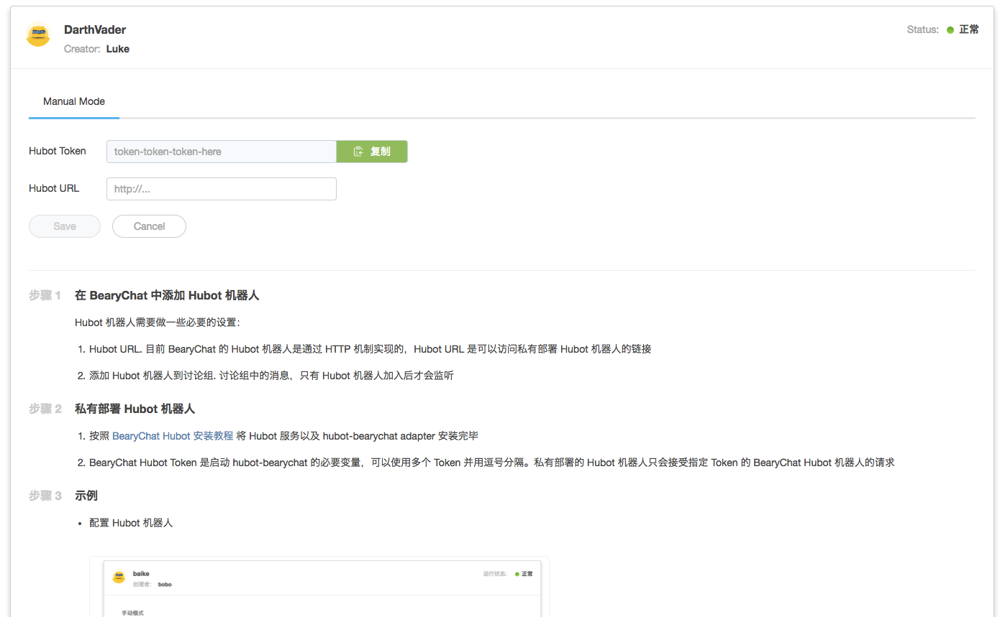
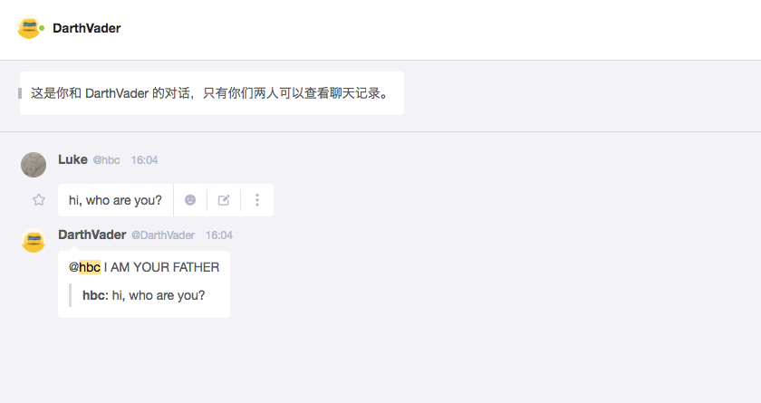
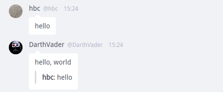
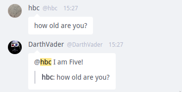
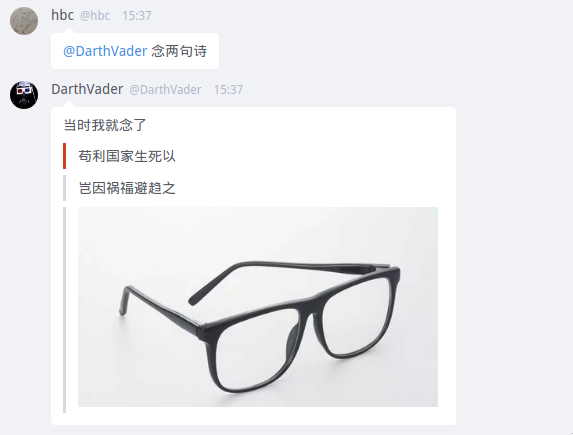

# hubot-bearychat

[BearyChat](https://bearychat.com) hubot adapter 实现

[](http://openapi.beary.chat/join)
[](https://travis-ci.org/bearyinnovative/hubot-bearychat)
[](https://npmjs.com/package/hubot-bearychat)

<!-- toc -->

- [真的只需要 5 分钟就能设置好的教程](#%E7%9C%9F%E7%9A%84%E5%8F%AA%E9%9C%80%E8%A6%81-5-%E5%88%86%E9%92%9F%E5%B0%B1%E8%83%BD%E8%AE%BE%E7%BD%AE%E5%A5%BD%E7%9A%84%E6%95%99%E7%A8%8B)
  * [第一步：获取 hubot token](#%E7%AC%AC%E4%B8%80%E6%AD%A5%E8%8E%B7%E5%8F%96-hubot-token)
  * [第二步：使用 yeoman 创建 hubot 项目](#%E7%AC%AC%E4%BA%8C%E6%AD%A5%E4%BD%BF%E7%94%A8-yeoman-%E5%88%9B%E5%BB%BA-hubot-%E9%A1%B9%E7%9B%AE)
  * [第三步：复制粘贴 hubot token... 以及启动你的 hubot!](#%E7%AC%AC%E4%B8%89%E6%AD%A5%E5%A4%8D%E5%88%B6%E7%B2%98%E8%B4%B4-hubot-token-%E4%BB%A5%E5%8F%8A%E5%90%AF%E5%8A%A8%E4%BD%A0%E7%9A%84-hubot)
  * [第四步：开始和 hubot 在讨论组中聊天](#%E7%AC%AC%E5%9B%9B%E6%AD%A5%E5%BC%80%E5%A7%8B%E5%92%8C-hubot-%E5%9C%A8%E8%AE%A8%E8%AE%BA%E7%BB%84%E4%B8%AD%E8%81%8A%E5%A4%A9)
- [Mode](#mode)
  * [RTM mode](#rtm-mode)
  * [HTTP mode](#http-mode)
- [配置项](#%E9%85%8D%E7%BD%AE%E9%A1%B9)
- [Hubot 响应](#hubot-%E5%93%8D%E5%BA%94)
  * [普通回复 `Send`](#%E6%99%AE%E9%80%9A%E5%9B%9E%E5%A4%8D-send)
  * [at 回复 `Reply`](#at-%E5%9B%9E%E5%A4%8D-reply)
  * [富文本回复 `bearychat.attachment`](#%E5%AF%8C%E6%96%87%E6%9C%AC%E5%9B%9E%E5%A4%8D-bearychatattachment)
- [LICENSE](#license)

<!-- tocstop -->

## 真的只需要 5 分钟就能设置好的教程

### 第一步：获取 hubot token

在你的团队机器人页面 (your-cool-team.bearychat.com/robots) 创建一个 hubot 机器人。
你可以在机器人详情表单中获取到 hubot token:



### 第二步：使用 yeoman 创建 hubot 项目

- `npm install -g hubot coffee-script yo generator-hubot`
- `mkdir -p /path/to/hubot`
- `cd /path/to/hubot`
- `yo hubot`
- `npm install hubot-bearychat --save`

同时你也可以访问 hubot 的[官方文档](https://github.com/github/hubot/tree/master/docs)获得更多帮助。

### 第三步：复制粘贴 hubot token... 以及启动你的 hubot!

```shell
$ export HUBOT_BEARYCHAT_TOKENS=token-token-token-here
$ export HUBOT_BEARYCHAT_MODE=rtm
$ ./bin/hubot -a bearychat
```

### 第四步：开始和 hubot 在讨论组中聊天



你还可以查看 [example/](example) 查看样例配置。

## Mode

### RTM mode

RTM 模式使用 BearyChat 的 RTM api 和 WebSocket 作为 hubot 的底层消息通讯协议。
在这个模式下，hubot 可以实时获取到所有已加入讨论组的消息。

要启用该模式，需要设置环境变量 `HUBOT_BEARYCHAT_MODE=rtm`.

目前 `hubot-bearychat` 默认使用该模式。

### HTTP mode

HTTP 模式是兼容的底层消息通讯协议。在这个模式中，hubot 只能接收到讨论组中明确
提及到的消息（例如 `@hubot 今天吃啥`）。同时你需要在 hubot 设置中填写 hubot 的
HTTP 服务地址。

要启用该模式，需要设置环境变量 `HUBOT_BEARYCHAT_MODE=http`.

## 配置项

`hubot-bearychat` 采用环境变量进行配置注入：

| 配置项 | 说明 |
|:------:|:------------|
| `HUBOT_BEARYCHAT_MODE` | hubot 使用的底层消息通讯协议，默认为 `rtm` |
| `HUBOT_BEARYCHAT_TOKENS` | hubot token, 必填 |

## Hubot 响应

### 普通回复 `Send`

Hubot 可以通过 `res.send` 来回复一个消息：

```
robot.hear /hello/, (res) ->
  res.send 'hello, world!'
```



### 回复 `Reply`

如果 hubot 在回复消息的同时想要引用作者的消息，可以使用 `res.reply`:

```
robot.hear /how old are you?/, (res) ->
  res.reply 'I am Five!'
```



### 向其他讨论组发消息

如果想让 Hubot 往非当前对话的讨论组发送消息可以使用 `robot.messageRoom`， 参数是 vchannelId，讨论组名称也即将支持。

```
robot.hear /voldemort/i, (res) ->
  robot.messageRoom(vchannel_id, "Somebody is talking about you, Voldemort!")
```

### 富文本回复 `bearychat.attachment`

如果 hubot 想要回复富文本消息，可以发送 `bearychat.attachment` 事件：

```
robot.respond /念两句诗/, (res) ->
  robot.emit 'bearychat.attachment',
    # required
    message: res.message
    # requried
    text: '当时我就念了...'
    attachments: [
      {
        color: '#cb3f20',
        text: '苟利国家生死以',
      },
      {
        text: '岂因祸福避趋之',
      },
      {
        images: [
          {url: 'http://example.com/excited.jpg'},
        ]
      }
    ]
```



## LICENSE

MIT
